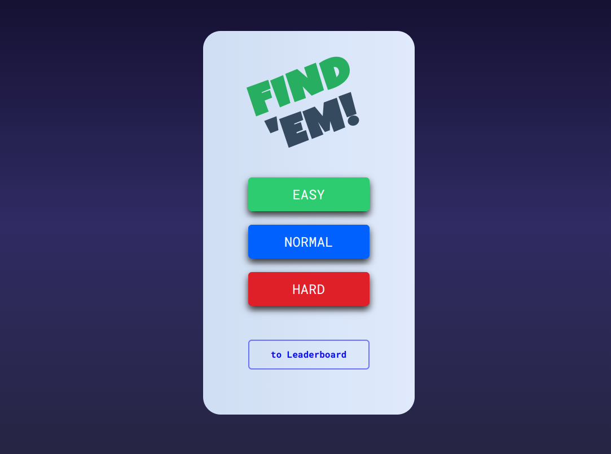
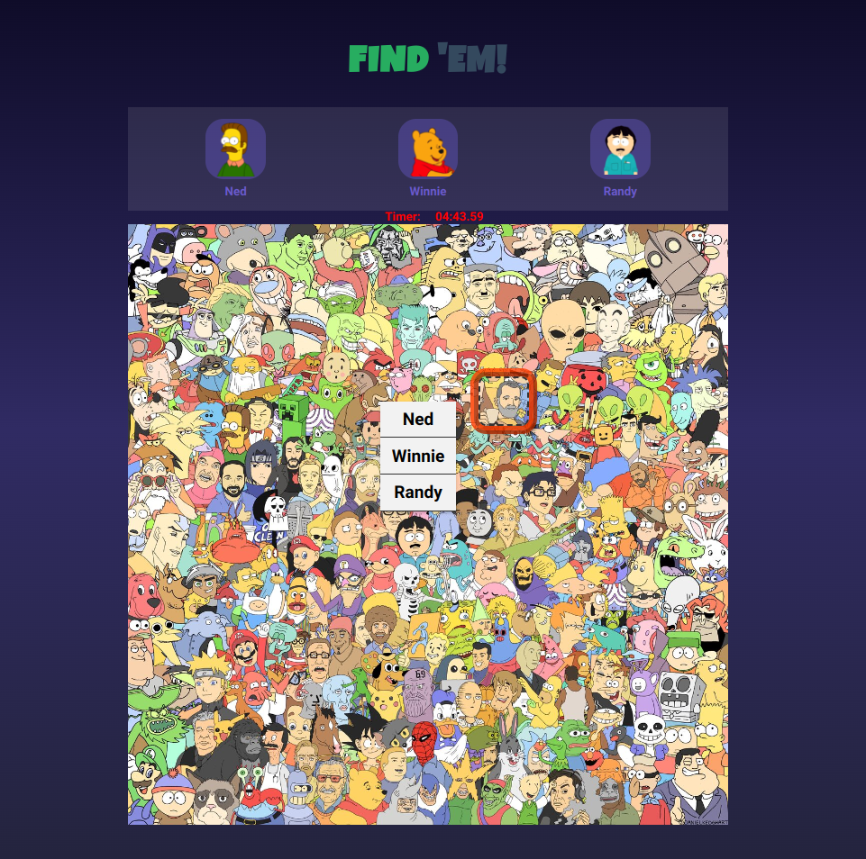
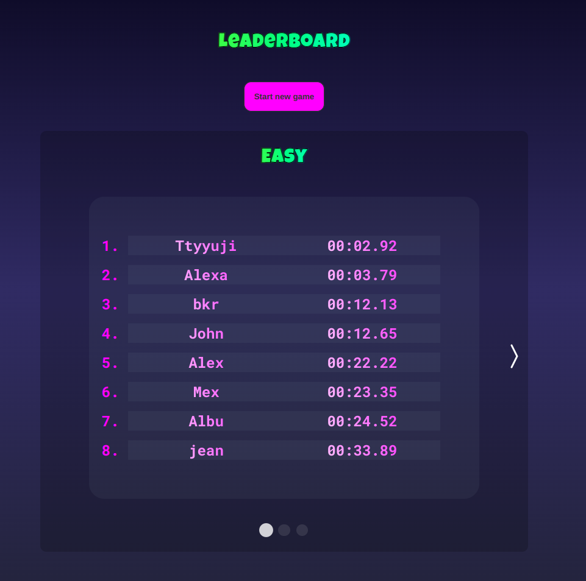

# Find 'Em!

This is a responsive fun little game similar to the classic Where's Waldo. Try to find the characters in the list for each level as fast as possible, the clock is ticking! Submit your time to see if you made it to Top Ten Leaderboard for that level.
(Image credits goes to the artist known as Sickpupz)

## Demo

Live Demo:
https://georgevictor90.github.io/find-em

## Screenshots

## Tech

This game was built using the following technologies and tools:

- [React](https://reactjs.org/) - A JavaScript library for building user interfaces
- [React Hooks](https://reactjs.org/docs/hooks-intro.html) - A new feature in React 16.8 that lets you use state and other React features without writing a class
- [Firebase Firestore](https://firebase.google.com/docs/firestore) - A flexible, scalable database for mobile, web, and server development from Firebase
- [Firebase Storage](https://firebase.google.com/docs/storage) - A powerful, simple, and cost-effective object storage service from Firebase
- [GitHub Pages](https://pages.github.com/) - Free static website hosting service
- [Create React App](https://create-react-app.dev/) - A tool for creating React apps with no build configuration

This project is bootstrapped with Create React App and written with React.js and React Hooks. The game's data is stored and retrieved from Firebase Firestore, and its images are stored in Firebase Storage. Finally, the game is deployed on GitHub Pages for free static website hosting.

## Features

- Works on mobile & desktop
- Leaderboards for each difficulty level

## License

[MIT](https://choosealicense.com/licenses/mit/)
